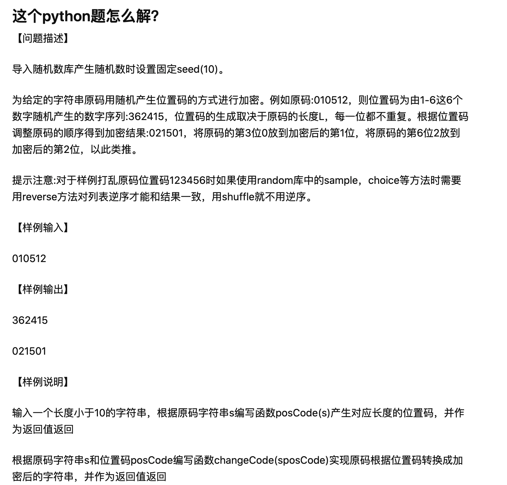

# zhihuAnswer
对知乎上的问题回答

+ mergeFile
    + text1.txt 文本一
    + text2.txt 文本二
    + zhihu_mergefile.py 处理程序

> Q:编写程序，将一个文本文件中的内容合并到另一个文本文件中，这个用python怎么做啊？ [原问题链接](https://www.zhihu.com/question/462545171/answer/1917045021)

> A:通过python的open方法，打开两个文件，一个以读取的方式打开，另外一个以追加写入的方式打开，把读取到的内容追加写入到另一个文本当中

+ zhihuEncript
    + zhihu_num_encript.py

> 
[原问题链接](https://www.zhihu.com/question/463915730/answer/1930775845)

> A:根据题目的规则，使用shuffle生成随机的位置码。通过位置码对原码进行加密。