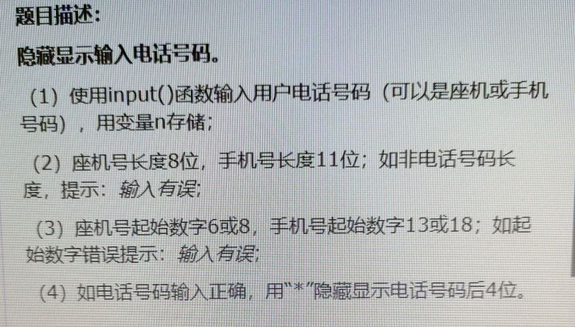
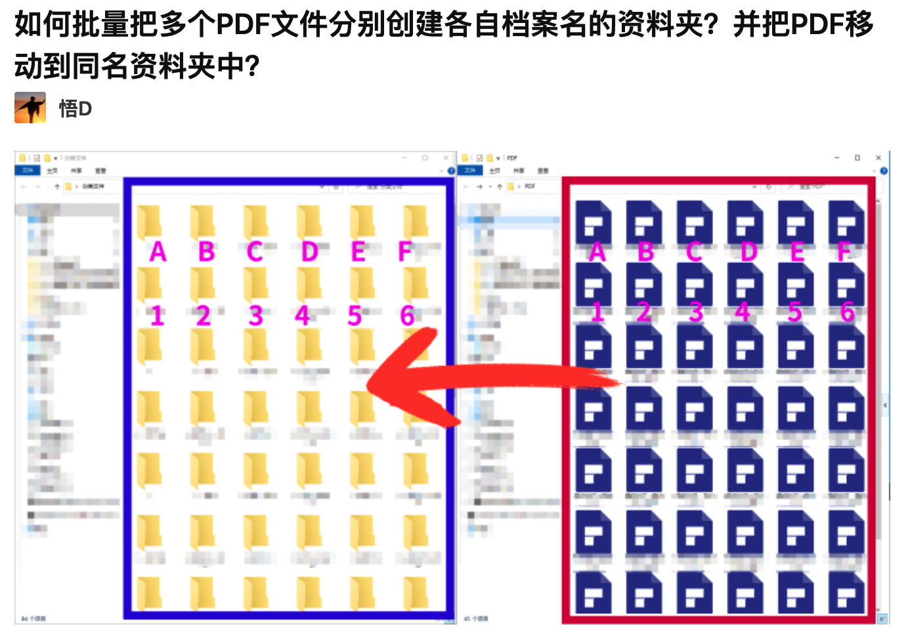

# zhihuAnswer
对知乎上的问题回答

## 1. mergeFile
    + text1.txt 文本一
    + text2.txt 文本二
    + zhihu_mergefile.py 处理程序

> Q:编写程序，将一个文本文件中的内容合并到另一个文本文件中，这个用python怎么做啊？ [原问题链接](https://www.zhihu.com/question/462545171/answer/1917045021)

> A:通过python的open方法，打开两个文件，一个以读取的方式打开，另外一个以追加写入的方式打开，把读取到的内容追加写入到另一个文本当中

## 2. zhihuEncript
    + zhihu_num_encript.py

> 
[原问题链接](https://www.zhihu.com/question/463915730/answer/1930775845)

> A:根据题目的规则，使用shuffle生成随机的位置码。通过位置码对原码进行加密。

## 3. hiddenPhoneNumber

[原问题链接](https://www.zhihu.com/question/459002018/answer/1881752431)

> A: 首先对用户输入对手机号进行正确性校验，如果输入正确就使用切片把后四位替换为*

## 4. pdfBetch

[原问题链接](https://www.zhihu.com/question/464754159/answer/1941019047)

> A:使用pathlib对文件进行操作，取出当前目录下对所有pdf文件，使用pdf对文件名作为文件夹对名称，把每个pdf文件移动到相应的文件夹里面。

## 5. wordCloud
Q: 用python画词云图有什么办法可以把词云图画成指定的汉字形状呢？
[原问题链接](https://www.zhihu.com/question/470816801/answer/1987453288)
> A: 使用python的wordcloud模块生成云图，使用pygame模块生成字体图片，使用jieba对内容进行分词处理，最终生成指定汉字形状对词云图。